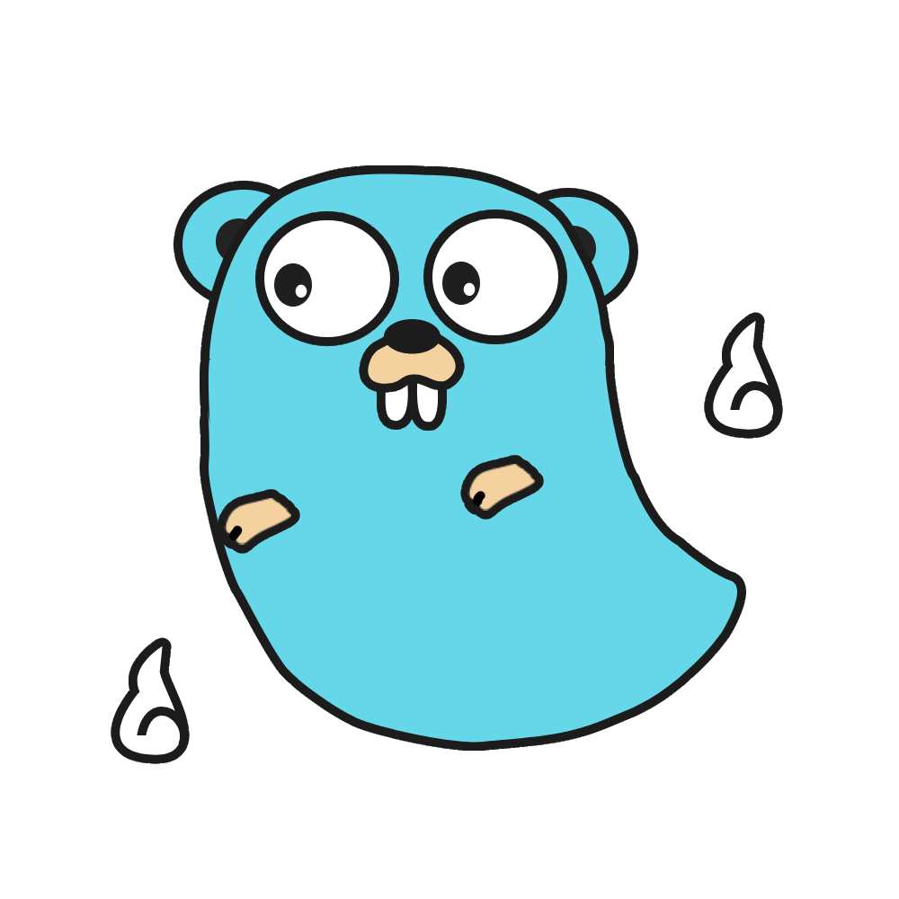

<p align="center"></p>
<p align="center">
  
  <a href="https://pkg.go.dev/github.com/deadblue/ghost"></a>
  
</p>

# GHOST

A simple HTTP server framework for Go, bases on std `net/http` package.

**Starts from 0.1.x, this framework should be used in go 1.18 or above, because it requires generic.**

## Usage

Just make an interesting ghost with all your businesses, then run it.

```go
package main

import (
    "github.com/deadblue/ghost"
    "github.com/deadblue/ghost/view"
)

// YourGhost does all your businesses.
type YourGhost struct{}

// Get will handle request "GET /".
func (g *YourGhost) Get(_ ghost.Context) (ghost.View, error) {
    return view.Text("You are here!"), nil
}

// GetIndexAsHtml will handle request "GET /index.html".
func (g *YourGhost) GetIndexAsHtml(_ ghost.Context) (ghost.View, error) {
    return view.Text("index.html"), nil
}

// GetDataById will handle request "GET /data/{id}".
func (g *YourGhost) GetDataById(ctx ghost.Context) (ghost.View, error) {
	// Get "id" from path variable
    dataId := ctx.PathVar("id")
    return view.Text("Getting data whose id is " + dataId), nil
}

// PostUpdate will handle request "POST /update".
func (g *YourGhost) PostUpdate(ctx ghost.Context) (ghost.View, error) {
    // TODO: Get post data from ctx.Request()
    return view.Text("Update done!"), nil
}

// BuyMeACoffee will handle request "BUY /me/a/coffee"
func (g *YourGhost) BuyMeACoffee(_ ghost.Context) (ghost.View, error) {
    return view.Text("Thank you!"), nil
}

func main() {
	// Give me your ghost, I'll run it as an HTTP server.
    err := ghost.Born(&YourGhost{}).Run()
    if err != nil {
        panic(err)
    }
}
```

## Mechanism

Each method on your ghost, whose signature is `func(ghost.Context) (ghost.View, error)`, will be mounted as a request handler. 

The method name, will be translated as the mount path, following these rules:

* Suppose the method name is in camel-case, split it into words.
* The first word will be treated as request method.
* If there is no remain words, the method function will handle the root request.
* If there are remained words, each word will be treated as a path segment.
* In remain words, there are some special words that won't be treated as path segment:
  * `By`: The next word will be treated as a path variable.
  * `As`: Link the next word with "." instead of path separator ("/").

For examples:

| Method Name       | Handle Request        |
|-------------------|-----------------------|
| Get               | GET /                 |
| GetIndex          | GET /index            |
| GetIndexAsHtml    | GET /index.html       |
| GetUserProfile    | GET /user/profile     |
| PostUserProfile   | POST /user/profile    |
| GetDataById       | GET /data/{id}        |
| GetDataByTypeById | GET /data/{type}/{id} |
| GetDataByIdAsJson | GET /data/{id}.json   |
| BuyMeACoffee      | BUY /me/a/coffee      |

## Accessories

There are some optional interfaces, you can implement on your ghost.

* StartupObserver
* ShutdownObserver
* ErrorHandler

Please check the reference for detail.

## Limitations

According to the design and mechanism, GHOST has the following limitations:

* GHOST can only handle the request in which each path segment is in lower case.
* There can be only one path variable in each path segment.

## License

MIT
